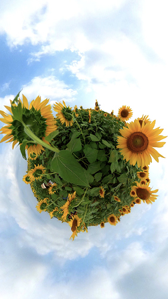
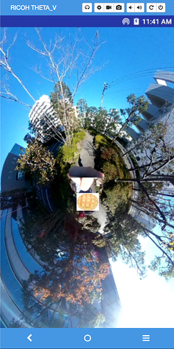

*This article was [originally published ](https://qiita.com/meronpan/items/d95d69d31386e8b2878f) in Japanese by [meronpan](https://qiita.com/meronpan) on the Qiita blogging site.*

# Introduction

This is the melon bread loving [@meronpan](https://qiita.com/meronpan) from RICOH. 

I wanted to show something unique using 360 degree images taken with THETA, so I've made a plug-in that shows images as Tiny Planets.

For those who are not familiar with Tiny Planets, here is an example.



360 degree pictures can be shown like this. Instagrammable!

Little Planets can be created using an app called [THETA+](https://theta360.com/en/about/application/edit.html).

For those who want to enjoy lots of different types of editing techniques, please try using THETA+.

However, by using the THETA plug-in described in this article, your picture will be turned into a Tiny Planet automatically when shooting.

OpenGL will be used to render THETA images as Tiny Planets. This process will be explained later.

I want to make the plug-in work like this:

1. Shoot images with THETA

2. Render the images as Tiny Planets, using OpenGL

3. Save the images as Tiny Planets

This article will explain steps 1 and 2. I am planning to write another article later for the 3rd step.

For those who are not familiar with THETA plug-ins, please see [here](https://api.ricoh/products/theta-plugin/).

# Table of Contents

The following points will be explained.

* What is OpenGL
* Description of Implementation
* Displaying Tiny Planets
* My Comments

# What is OpenGL

Wikipedia explains OpenGL as a "2D/3D computer graphics library."

Images shot with THETA are saved as 2D images, but these 2D images can be converted and shown in various ways by using OpenGL.

OpenGL has the Android standard library, but considering processing efficiency, a method of using from native code is chosen.

By the way, I've referred to below links regarding OpenGL.

—Multiplatform OpenGL ES Manual (basic version)

http://www.cutt.co.jp/book/978-4-87783-301-5.html [in Japanese]

— OpenGL ES Manual for multiplatform (practical use version)

http://www.cutt.co.jp/book/978-4-87783-343-5.html [in Japanese]

Note: OpenGL ES is a flavor of the OpenGL specification intended for embedded devices.

These books are very easy to understand. I recommend them. [translator's note: I was not able to find exact equivalents in English]

# Description of Implementation

There are too many items to describe in detail, so this will be a brief version.

## Setting the Environment

Please refer to the links below for Android Studio introduction and plug-in development environment.

[THETA Plug-in Development - Steps for Putting Your THETA into Developer Mode](https://community.theta360.guide/t/ricoh-blog-post-theta-plug-in-development-steps-for-putting-your-theta-into-developer-mode/3141)

[THETA Plug-in SDK Setup](http://theta360.guide/plugin-guide/setup/)

[Ricoh THETA V Plugin Application Development Community Guide](http://theta360.guide/plugin-guide/)

[Android Studio](https://developer.android.com/studio/)

## Download RICOH THETA Plug-in SDK

This is made with [RICOH THETA Plug-in SDK](https://github.com/ricohapi/theta-plugin-sdk) as a base (Android Studio project).

## Use of Android NDK

1. Start Android Studio and select Tools > SDK Manager from menu.

2. Select SDK Tools tab, check LLDB, CMake, NDK and click OK.

3. Click Finish when installation is done.

## Use of Native Language

This is a side topic, but when checking include C++ support in Android Studio in a new project, the following will be added to a new project.

— Native source directory （src/main/cpp）

— CMake build script （CmakeLists.txt）

— Plus adding the following configuration items inside build.gradle.

```
android {
    ・・・
    externalNativeBuild {
        cmake {
            path "CMakeLists.txt"
        }
    }
}
```

These are items necessary to use native language, and these are added to the sample code.

In my sample code, the cpp folder is renamed to jni.

Please see the following link for more details.

https://developer.android.com/studio/projects/add-native-code

## About Native Code

There are two directories in my sample code&rsquo;s native source directory (src/main/jni).

— Support

Mostly OpenGL functions are used. I&rsquo;ve used sample code from the manual I have introduced in the segment "What is OpenGL."

— OpenGL

Coding OpenGL's processing.

The 4 items below are the basic functions to process graphics using OpenGL.

The books mentioned in "What is OpenGL" have been referenced for this implementation.

* `initialize()`

Initialization process of graphic rendering processing using OpenGL takes place.

* `resized()`

Will be called immediately after initialize() or when a screen&rsquo;s orientation gets switched between horizontal and vertical.

* `rendering()`

Will be called when rendering takes place. Rendering processing is coded within this function.

* `destroy()`

Release process occurs here.

## About Java and Native Function Exchange

Please refer to the following link.

https://community.theta360.guide/t/how-android-developers-can-build-fastcv-apps-for-the-ricoh-theta-part-1/3920

# Displaying Tiny Planets

Checked the processed images using Vysor.

For Vysor, please refer to the following article.

http://theta360.guide/plugin-guide/tutorialvysor/

When the plug-in is implemented and shutter button is pressed…



It's a Tiny Planet!

By the way, plug-in source code is available GitHub.

https://github.com/theta-skunkworks/theta-plugin-opengl-sample

However, since this is still a work in progress, this cannot be used as a plug-in yet.

Every time a picture is taken, you have to jump out of Plug-in Mode in order to view it...

Saving the picture is still not figured out…

And more...

# My Comments

First of all, I would like to thank those related to the books introduced in "What is OpenGL" for permission to post some content and code.

They are very easy to understand, so please read read through them.

I covered the rendering process inside `rendering()`. However, once you understand the basic processing flow of OpenGL, you can enjoy the broader graphics world simply by changing the rendering calculations.

I've played around and displayed the pictures I took with THETA by turning them in heart shapes or spinning them around with a shape of swirled candy.

Please try developing plug-ins with this article as a reference!

I'm certain you'll love working with THETA plug-ins.
